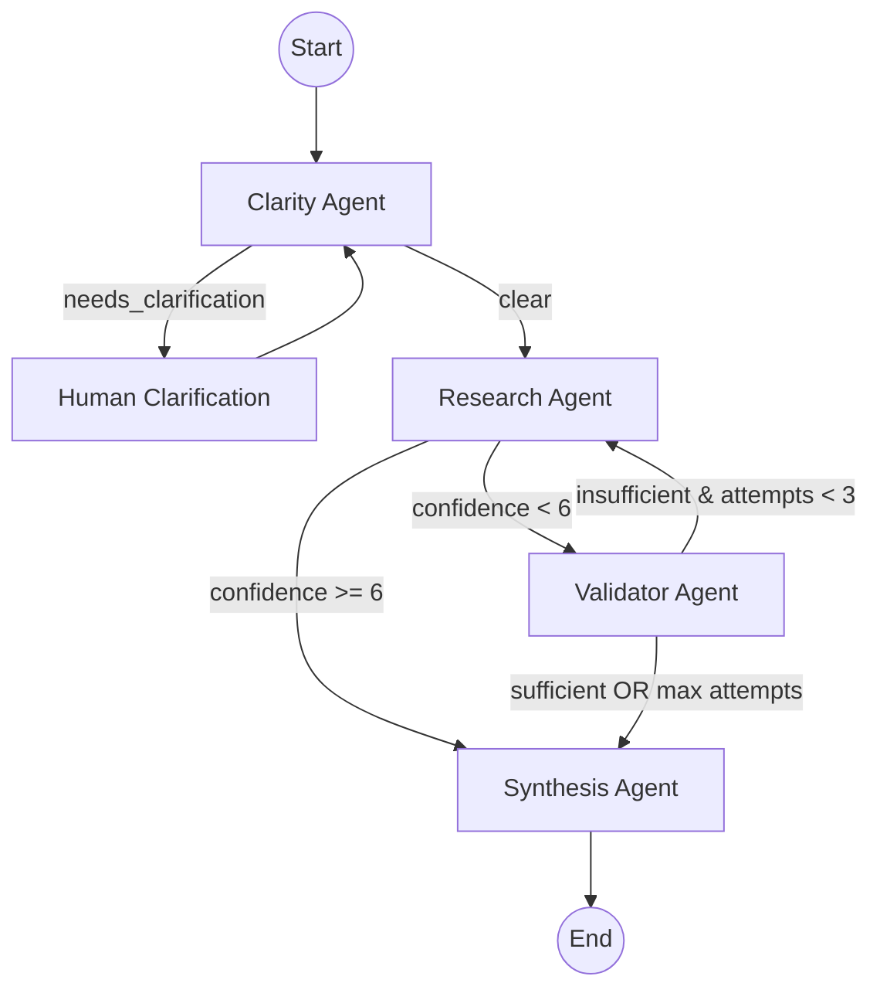

# LangGraph Multi-Agent Research Assistant

A production-grade multi-agent research assistant built with LangGraph that helps users gather information about companies. The system features 4 specialized agents working together, supports follow-up questions, and requests human clarification when queries are ambiguous.

## Table of Contents

- [Features](#features)
- [Architecture](#architecture)
- [Installation](#installation)
- [Configuration](#configuration)
- [Usage](#usage)
- [Docker Deployment](#docker-deployment)
- [Example Conversations](#example-conversations)
- [Project Structure](#project-structure)
- [Testing](#testing)
- [Assumptions](#assumptions)
- [Beyond Expected Deliverable](#beyond-expected-deliverable)

## Features

- **4 Specialized Agents**: Clarity, Research, Validator, and Synthesis agents working in coordination
- **Tavily Search Integration**: Real-time web search using Tavily API (preferred) with mock data fallback
- **Human-in-the-Loop**: Automatic clarification requests when queries are ambiguous
- **Multi-turn Conversations**: Maintains context across multiple queries with follow-up support
- **Conditional Routing**: Intelligent routing based on query clarity, research confidence, and validation results
- **Feedback Loop**: Research retry mechanism (up to 3 attempts) when validation is insufficient
- **Mock Data Support**: Built-in company data for Apple, Tesla, Microsoft, Google, Amazon, Meta, NVIDIA, Netflix
- **Docker Ready**: Production-ready containerization

## Architecture

### Agent Workflow



### Agent Responsibilities

| Agent | Input | Output | Routes To |
|-------|-------|--------|-----------|
| **Clarity Agent** | User query | `clarity_status`, `detected_company` | Human Clarification (if unclear) OR Research |
| **Research Agent** | Company name, query | `research_findings`, `confidence_score` | Validator (if confidence < 6) OR Synthesis |
| **Validator Agent** | Research findings | `validation_result`, `validation_feedback` | Research (retry if insufficient) OR Synthesis |
| **Synthesis Agent** | All findings | `final_response` | END |

### State Schema

The workflow maintains a comprehensive state including:
- User query and conversation history
- Clarity status and detected company
- Research findings with confidence score
- Validation result and feedback
- Research attempt counter (max 3)
- Human-in-the-loop flags

## Installation

### Prerequisites

- Python 3.10+
- Anthropic API key ([Get one here](https://console.anthropic.com/))

### Local Installation

```bash
# Clone or navigate to the project
cd LangGraphResearchAssistant

# Create virtual environment (optional but recommended)
python -m venv venv
source venv/bin/activate  # On Windows: venv\Scripts\activate

# Install dependencies
pip install -r requirements.txt
```

### Using Make

```bash
make install
```

## Configuration

### Environment Variables

Create a `.env` file in the project root (copy from `.env.example`):

```bash
# Required: Anthropic API Key
ANTHROPIC_API_KEY=your_anthropic_api_key_here

# Optional: Tavily Search API Key (preferred search tool per requirements)
# Get your API key from: https://tavily.com/
TAVILY_API_KEY=your_tavily_api_key_here

# Optional: Model Configuration
DEFAULT_MODEL=claude-3-5-sonnet-20241022
TEMPERATURE=0.0

# Optional: Research Settings
# Set USE_MOCK_DATA=false to use Tavily Search API
USE_MOCK_DATA=true
MAX_RESEARCH_ATTEMPTS=3
CONFIDENCE_THRESHOLD=6.0

# Optional: Logging
LOG_LEVEL=INFO
```

### Available Settings

| Variable | Default | Description |
|----------|---------|-------------|
| `ANTHROPIC_API_KEY` | Required | Your Anthropic API key |
| `TAVILY_API_KEY` | Optional | Tavily Search API key for real-time web search |
| `DEFAULT_MODEL` | `claude-3-5-sonnet-20241022` | Claude model to use |
| `TEMPERATURE` | `0.0` | LLM temperature (0-1) |
| `USE_MOCK_DATA` | `true` | Use mock data (set to `false` to use Tavily) |
| `MAX_RESEARCH_ATTEMPTS` | `3` | Maximum research retry attempts |
| `CONFIDENCE_THRESHOLD` | `6.0` | Threshold for skipping validation |
| `LOG_LEVEL` | `INFO` | Logging verbosity |

### Using Tavily Search API

The Research Agent supports [Tavily Search API](https://tavily.com/) as the preferred search tool (per requirements). To enable real-time web search:

1. Get a Tavily API key from https://tavily.com/
2. Set `TAVILY_API_KEY` in your `.env` file
3. Set `USE_MOCK_DATA=false`

```bash
TAVILY_API_KEY=tvly-your-api-key-here
USE_MOCK_DATA=false
```

When Tavily is enabled, the Research Agent will:
- Search for recent news about the company
- Gather stock/financial information
- Find key developments relevant to the user's query
- Include source URLs in the response

If Tavily is not configured or fails, the system automatically falls back to mock data.

## Usage

### Interactive Mode (Default)

```bash
python -m src.research_assistant.main
```

Or using Make:
```bash
make run
```

### Single Query Mode

```bash
python -m src.research_assistant.main -q "Tell me about Apple's AI strategy"
```

Or using Make:
```bash
make run-query QUERY="Tell me about Tesla's recent developments"
```

### Verbose Mode

```bash
python -m src.research_assistant.main -v
```

### Interactive Commands

Once in interactive mode:
- Type your question to get company research
- `new` - Start a fresh conversation
- `state` - Show current conversation state
- `help` - Show help message
- `quit` or `exit` - End the session

## Docker Deployment

### Build and Run

```bash
# Build the image
docker build -t research-assistant:latest .

# Run with docker-compose
docker-compose up research-assistant
```

### Development Mode

```bash
docker-compose --profile dev up research-assistant-dev
```

### Using Make

```bash
make docker-build
make docker-run
```

### Environment Variables with Docker

Pass your API key via environment:

```bash
ANTHROPIC_API_KEY=your_key docker-compose up research-assistant
```

Or create a `.env` file that docker-compose will read automatically.

## Example Conversations

### Example 1: Clear Query with Direct Response

```
📝 You: What are Apple's latest developments in AI?

⏳ Processing your request...

────────────────────────────────────────────────────────────
🤖 Assistant:

Apple has been making significant strides in AI integration across its product line. Here's a summary:

**Recent AI Developments:**
- Apple Intelligence features are rolling out across iOS 18 and macOS Sequoia
- Privacy-focused on-device AI processing
- Launched Vision Pro with advanced AI capabilities

**Financial Position:**
- Stock trading at $195, up 45% YTD
- Market cap exceeds $3 trillion
- Strong Q4 earnings with services revenue growth

**Key Strategic Focus:**
- AI integration while maintaining privacy as a differentiator
- Continued expansion of manufacturing in India
- Services revenue growth through AI-enhanced features

Would you like more details on any specific aspect?
────────────────────────────────────────────────────────────
```

### Example 2: Follow-up Question (Context Maintained)

```
📝 You: What about their competitors?

⏳ Processing your request...

────────────────────────────────────────────────────────────
🤖 Assistant:

Based on Apple's position in the technology industry, here are the main competitors:

**Primary Competitors:**
- **Microsoft** - Competing in productivity software and cloud services
- **Google** - Competing in mobile OS (Android vs iOS) and AI
- **Samsung** - Competing in consumer electronics and smartphones

Each competitor is also heavily investing in AI capabilities, making it a key battleground for the industry.
────────────────────────────────────────────────────────────
```

### Example 3: Unclear Query with Human Clarification

```
📝 You: Tell me about the stock

⏳ Processing your request...

🤔 Clarification needed: Which company's stock would you like to know about?
   Please specify the company name (e.g., Apple, Tesla, Microsoft).

📝 Your clarification: Tesla

⏳ Processing clarification...

────────────────────────────────────────────────────────────
🤖 Assistant:

Here's the latest information on Tesla's stock:

**Stock Performance:**
- Currently trading at $242
- Experiencing a volatile quarter
- Facing increased EV competition affecting valuation

**Key Factors:**
- Cybertruck deliveries ramping up
- FSD v12 rollout with end-to-end neural network
- Energy storage business (Megapack) showing strong growth

**Industry Context:**
Tesla remains a leader in the EV market but faces growing competition from both traditional automakers and new EV companies.
────────────────────────────────────────────────────────────
```

## Project Structure

```
LangGraphResearchAssistant/
├── src/
│   └── research_assistant/
│       ├── __init__.py              # Package initialization
│       ├── main.py                  # CLI entry point
│       ├── app.py                   # Application class
│       ├── config.py                # Configuration management
│       ├── graph.py                 # LangGraph workflow
│       ├── state.py                 # Pydantic state models
│       ├── agents/
│       │   ├── __init__.py
│       │   ├── base.py              # Base agent class
│       │   ├── clarity_agent.py     # Query clarity analysis
│       │   ├── research_agent.py    # Company research
│       │   ├── validator_agent.py   # Research validation
│       │   └── synthesis_agent.py   # Response synthesis
│       ├── tools/
│       │   ├── __init__.py
│       │   ├── mock_data.py         # Mock company data
│       │   └── research_tool.py     # Research tool interface
│       ├── routing/
│       │   ├── __init__.py
│       │   └── conditions.py        # Routing functions
│       └── utils/
│           ├── __init__.py
│           └── logging.py           # Logging setup
├── tests/
│   ├── __init__.py
│   ├── conftest.py                  # Test fixtures
│   ├── test_routing.py              # Routing tests
│   ├── test_state.py                # State model tests
│   ├── test_tools.py                # Tool tests
│   └── test_graph_flow.py           # Integration tests
├── docs/                            # Documentation folder
├── input/                           # Input files (optional)
├── output/                          # Output files
├── .env                             # Environment variables
├── .env.example                     # Environment template
├── .gitignore
├── Dockerfile
├── docker-compose.yml
├── Makefile
├── pyproject.toml
├── requirements.txt
└── README.md
```

## Testing

### Run All Tests

```bash
pytest tests/ -v
```

Or using Make:
```bash
make test
```

### Run Specific Test Files

```bash
pytest tests/test_routing.py -v
pytest tests/test_state.py -v
pytest tests/test_tools.py -v
```

### Test Coverage

```bash
make test-coverage
```

## Assumptions

The following assumptions were made during implementation:

1. **Mock Data Priority**: The system uses mock data by default for demonstrations. In production, this could be extended to use real-time APIs (Tavily, etc.).

2. **Company Detection**: The Clarity Agent uses LLM reasoning to detect company names, including handling aliases (e.g., "AAPL" -> "Apple Inc.") and context from conversation history.

3. **Confidence Scoring**: The Research Agent's confidence score (0-10) is determined by the LLM based on data completeness and relevance to the query.

4. **Validation Criteria**: The Validator Agent considers relevance, completeness, and quality when determining if research is sufficient.

5. **Context Window**: Follow-up questions rely on conversation history maintained in state. The most recent 5-10 messages are used for context.

6. **Interrupt Mechanism**: The human-in-the-loop uses LangGraph's `interrupt()` function which pauses execution and waits for user input.

7. **Maximum Attempts**: The feedback loop (Validator -> Research) is limited to 3 attempts to prevent infinite loops.

8. **Thread Isolation**: Each conversation thread is isolated with its own state, identified by a unique thread ID.

## Beyond Expected Deliverable

The following enhancements go beyond the basic requirements:

### 1. Tavily Search API Integration
- Implemented Tavily as the preferred search tool (as specified in requirements)
- Real-time web search for company news, stock info, and developments
- Automatic fallback to mock data if Tavily is unavailable
- Configurable via environment variables

### 2. Extended Mock Data
- Added 8 companies (beyond required Apple and Tesla)
- Included additional fields: competitors, industry, CEO
- Case-insensitive company matching with aliases

### 3. Production-Ready Structure
- Clean modular architecture with separation of concerns
- Pydantic models with validation
- Comprehensive error handling
- Detailed logging throughout

### 4. Docker Deployment
- Multi-stage Dockerfile for optimized images
- Docker Compose with development profile
- Health check configuration

### 5. Developer Experience
- Makefile with common commands
- Comprehensive test suite (routing, state, tools, integration)
- Verbose logging mode for debugging
- State inspection command in CLI

### 6. CLI Features
- Interactive and single-query modes
- Help system and command hints
- Conversation state inspection
- Graceful error handling

### 7. Graph Visualization
- Built-in Mermaid diagram generation
- Visual representation of workflow

### 8. Flexible Configuration
- All settings configurable via environment
- Sensible defaults for quick start
- Validation of required settings

### 9. Code Quality
- Type hints throughout
- Docstrings for all public methods
- Consistent code style
- Clear separation between agents, tools, and routing

---

## License

MIT License

## Contributing

Contributions are welcome! Please ensure tests pass before submitting PRs.

## Support

For issues or questions, please open a GitHub issue.
